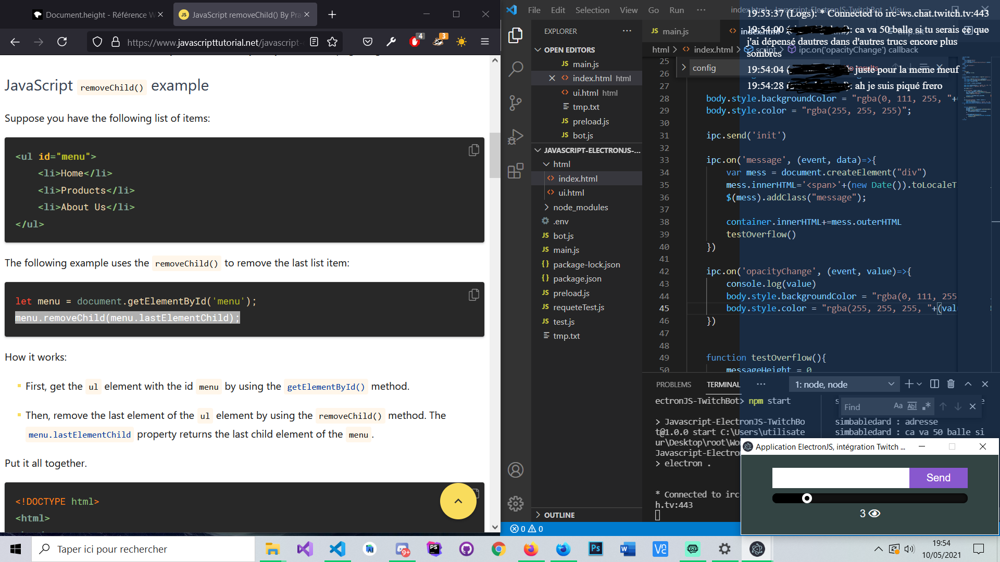
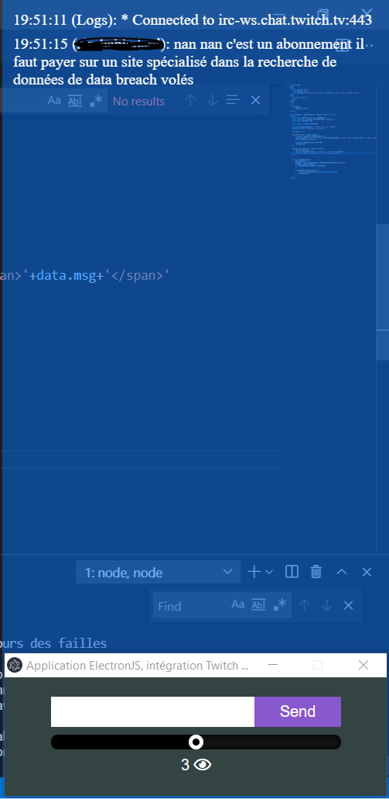

# Javascript-ElectronJs-TwitchOverlay

## Configuration

Make a .env file to the root of the project. Here is the template :

```json
BOT_USERNAME=Your_bot_name  
OAUTH_TOKEN=Your_oauth_token (https://twitchapps.com/tmi/)
CHANNEL_NAME=Your_channel_name  
CLIENT_ID=Your_client_id (https://dev.twitch.tv/console/apps)  
CLIENT_SECRET=Your_client_secret (https://dev.twitch.tv/console/apps again)  
windowWidth=Width_of_chat (400 is pretty good)  
streamDataUpdate=Time_between_updates_for_stream_data_in_second (30 is a good value)
```
Exemple (with fake data)
```json
BOT_USERNAME=TwitchBot
OAUTH_TOKEN=2o21e9aen4rtf3xdet9uorzr63hdql
CHANNEL_NAME=clemiscoding
CLIENT_ID=gzawlerzuo28d2eq1revw23zvf6it5
CLIENT_SECRET=yf2ljtpsea93hxklbvzerue4nemu9q
windowWidth=400
streamDataUpdate=30
```

## Installation

- Config the .env file as shown
- Go to the project root and put this command: `npm install`
- Start the app with: `npm start`

There is no error handling if you env file is not well configured.

## Software screenshots



Keep 100% of your screen available while you stream. Choose background opacity and watch the viewer count.

## Code you can reuse from Twitch API

### IRC

```
//Quite the same code as twitch documentation
const opts = {
        identity: {
            username: process.env.BOT_USERNAME,
            password: process.env.OAUTH_TOKEN
        },
        channels: [
            process.env.CHANNEL_NAME
        ]
    };
    // Create a client with our options
    const client = new tmi.client(opts);
    // Register our event handlers (defined below)
    client.on('message', onMessageHandler);
    client.on('connected', onConnectedHandler);
```

### Get stream data
```
async function getStreamData() {
    var streamData
    //First request -> for authentification, you get your app access token from this request
    await axios.post(
            'https://id.twitch.tv/oauth2/token?client_id=' + process.env.CLIENT_ID + '&client_secret=' + process.env.CLIENT_SECRET + '&grant_type=client_credentials&scope=channel_read')
        .then(response => {
            oauthToken = response.data.access_token;
        })
        //Second requtest allows you to get stream data for a user (in this case it's you). Thanks to then oauth token you can proceed this request.
    await axios.get(`https://api.twitch.tv/helix/streams?user_login=${process.env.CHANNEL_NAME}`, {
        headers: {
            'Client-Id': process.env.CLIENT_ID,
            'Authorization': `Bearer ${oauthToken}`
        },
    }).then(result => {
        streamData = result.data
    }).catch(error => {
        console.log(error)
    });

    return streamData;
}
```

## Other stuff



## Liscence

I don't know a lot about liscences, feel free to use and reuse this code as you want.
